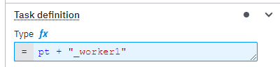

# Example for Zeebe Namespace using the default ID Tag

This example creates the namespace from the default variables `processKey` and
`version`.

The values are given in the properties-section of the [pom.xml](pom.xml) and set
with filtering from the maven-resource-plugin into the
[application.properties](src/main/resources/application.properties).

## Job Workers

Each task type in the BPMN diagram has to be a FEEL expression that contains the
worker name in quotes starting with an underscore. The expression starts with
`pt + `.

**Benefit:** The namespace is added explicitly, which helps to remember the
namespace when you have to change the process years later for some maintenance.

**Downside:** Additional effort to convert the worker into a FEEL expression
with some additions to the worker name.

## Process ID

The process ID contains placeholders to replace the `process.tag` with filtering
from the maven-resource-plugin.

The ID in the [example1.bpmn](src/main/resources/example1.bpmn) is
`AAAprocess.tagAAA_Example1Process`, which will be replaced with
`processOne_1_0_Example1Process` during maven packaging. The process has to be
deployed with the `@Deployment` annotation when starting the spring boot
application.
